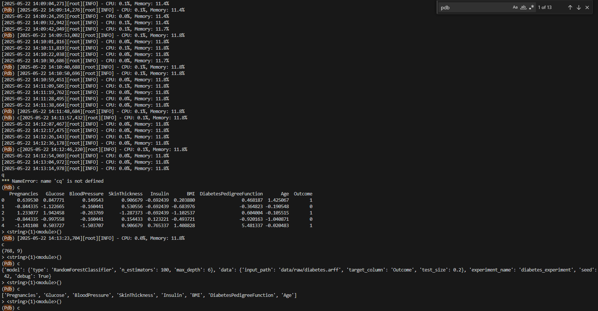

# PHASE 2: Enhancing ML Operations with Containerization & Monitoring

## 1. Containerization
- [x] **1.1 Dockerfile**
  - [x] Dockerfile created and tested
  - [x] Instructions for building and running the container
- [x] **1.2 Environment Consistency**
  - [x] All dependencies included in the container

## 2. Monitoring & Debugging

- [x] **2.1 Debugging Practices**
  - [x] Debugging tools used (e.g., pdb)
    * pdb
  - [x] Example debugging scenarios and solutions
    * [Debugging README.md](debug_examples/README.md)
  - [x] command line output running on docker compose run --rm trainer debug=true
    * 
## 3. Profiling & Optimization
- [x] **3.1 Profiling Scripts**
  - [X] cProfile, PyTorch Profiler, or similar used
    ## Tools Used
    * `cProfile` via custom `@profile_function` decorator
    * `PerformanceTracker` class for custom timing
    ## Key Results
    * Total train-evaluate duration: 0.253s
    * Model fitting (`.fit()`): 0.142s
    * Model saving: 0.088s
    * Total function calls: ~473k
    * Most expensive step: model.fit()
    * Main bottleneck: Random Forest training and pickling
    ## Resource Monitoring
    * CPU usage remained <0.5%
    * Memory usage stable around 12%
  - [x] Profiling results and optimizations documented
    ## Optimizations
    * Reduced tree depth (max_depth=6)
    * Lightweight model with joblib dump
    * Parallel tree building via sklearn's `joblib`
    [example_profiling.txt](examples/example_profiling.txt)

## 4. Experiment Management & Tracking
- [x] **4.1 Experiment Tracking Tools**
  - [x] MLflow, Weights & Biases, or similar integrated
      * Experiment Tracking with MLflow
      * We use MLflow to track experiments and manage model data
      * install mlflow
      *   pip install mlflow
  - [x] Logging of metrics, parameters, and models
      * 
      * 
  - [x] Instructions for visualizing and comparing runs
      * visualize outputs on local machine:
          *   mlflow ui
          *   open browser go to:
          *     http://localhost:5000/
          *     diabetes-prediction -> select run -> Model metrics for visualizations

## 5. Application & Experiment Logging
- [x] **5.1 Logging Setup**
  - [x] logger and/or rich integrated
  * Tool Used: Python’s built-in logging module
  *  Where Configured:
  *   diabetes_predictor/utils/logging_config.py
  - [x] Example log entries and their meaning
    [example_log.txt](examples/example_log.txt)
    * INFO: Starting model training process	Marks the beginning of training
    * INFO: Data loaded and preprocessed. Shape: (768, 9)	Confirms successful data loading
    * INFO: Training set size: 614, Test set size: 154	Shows data split results
    * INFO: Model training completed. Final accuracy: 0.7468	Outputs final model accuracy
    * INFO: MLflow run completed	Indicates MLflow logging has finished
    * INFO: RandomForestTrainer - training_duration_sec: 0.142	Time taken to train the model
    * INFO: Prediction result: Non-Diabetic	Output of a sample prediction

## 6. Configuration Management
- [x] **6.1 Hydra or Similar**
  * hydra
  - [x] Configuration files created
    * Main config: configs/config.yaml
    * Model settings: configs/model/random_forest.yaml
    * Data settings: configs/data/diabetes_dataset.yaml
  - [x] Example of running experiments with different configs
    * python -m diabetes_predictor.train_model
    * Model training completed. Final accuracy: 0.7468
    * [example_hydra_standard.txt](examples\example_hydra_standard.txt) full example

                    precision    recall  f1-score   support
                 0       0.79      0.84      0.81       100
                 1       0.66      0.57      0.61        54
          accuracy                           0.75       154
          macro avg      0.72      0.71      0.71       154
          weighted avg   0.74      0.75      0.74       154

    * python -m diabetes_predictor.train_model model.n_estimators=200 model.max_depth=10
    * Model training completed. Final accuracy: 0.7532
    * [example_hydra_p1.txt](examples/example_hydra_p1.txt) full example

                    precision    recall  f1-score   support
                 0       0.80      0.83      0.81       100
                 1       0.66      0.61      0.63        54
          accuracy                           0.75       154
          macro avg      0.73      0.72      0.72       154
          weighted avg   0.75      0.75      0.75       154

    * python -m diabetes_predictor.train_model model.n_estimators=250 model.max_depth=15
    * Model training completed. Final accuracy: 0.7532

                     precision    recall  f1-score   support
                  0       0.80      0.83      0.81       100
                  1       0.66      0.61      0.63        54
           accuracy                           0.75       154
           macro avg      0.73      0.72      0.72       154
          weighted avg    0.75      0.75      0.75       154

    * python -m diabetes_predictor.train_model model.n_estimators=50 model.max_depth=3
    * Final accuracy: 0.7403

                      precision    recall  f1-score   support
                   0       0.76      0.88      0.81       100
                   1       0.68      0.48      0.57        54

            accuracy                           0.74       154
           macro avg       0.72      0.68      0.69       154
          weighted avg     0.73      0.74      0.73       154

## 7. Documentation & Repository Updates
- [x] **7.1 Updated README**
  - [x] Instructions for all new tools and processes
  - [x] All scripts and configs included in repo

---

> **Checklist:** Use this as a guide for documenting your Phase 2 deliverables. Focus on operational robustness, reproducibility, and clear instructions for all tools and processes.
