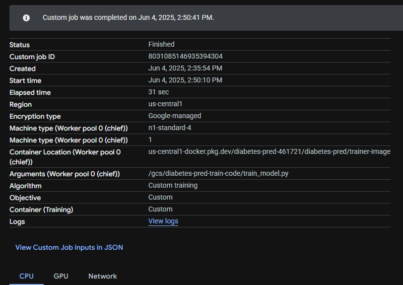

# PHASE 3: Continuous Machine Learning (CML) & Deployment

## 1. Continuous Integration & Testing
- [x] **1.1 Unit Testing with pytest**
  - [x] Test scripts for data processing, model training, and evaluation
    * Data Processing Tests (`tests/test_data.py`):
        - `test_data_preprocessing`: Ensures proper data preprocessing (normalization, missing values)
        - `test_train_test_split`: Tests data splitting functionality
    * Model Tests (`tests/test_model.py`):
        - `test_model_output_shape`: Verifies correct output shape of model predictions
        - `test_model_probability_shape`: Validates probability output shape
    * Training Tests (`tests/test_training.py`):
        - `test_train_test_split`: Ensures proper data splitting and distribution preservation
        - `test_forward_pass`: Validates model predictions on single and multiple samples
        - `test_model_training_and_evaluation`: Tests complete training pipeline and metrics
        - `test_invalid_input`: Verifies proper error handling for invalid inputs
        - `test_model_hyperparameters`: Tests model performance with different configurations:
        * Small model (50 trees, depth 3, min accuracy 0.75)
        * Medium model (100 trees, depth 6, min accuracy 0.80)
        * Large model (200 trees, depth 10, min accuracy 0.85)
        - `test_train_model_main`: Tests the main training function with configuration
  - [x] Documentation of the testing process and example test cases
    * Running Tests:
        python -m pytest
    * Example Test Cases:
        # Testing model output shapes
        def test_model_output_shape():
            model = RandomForestTrainer()
            X = sample_data.drop('Outcome', axis=1)
            predictions = model.predict(X)
            assert predictions.shape == (len(X),)
- [x] **1.2 GitHub Actions Workflows**
  - [x] CI workflows for running tests, DVC, code checks (e.g., ruff), Docker builds
  - [x] Workflow YAML files included
    * `.github/workflows/tests.yml`: main pytests file
    * `.github/workflows/codecheck.yml`: codechecking (ruff/mypy)

- [x] **1.3 Pre-commit Hooks**
  - [x] Pre-commit config and setup instructions
    * Setup Instructions:
        1. Install pre-commit: `pip install pre-commit`
        2. Install the hooks: `pre-commit install`
        3. Run manually: `pre-commit run --all-files`
        - Bypass with `git commit --no-verify -m "Bypassing pre-commit"`
        - Disable with `pre-commit uninstall`
        - Config at `.pre-commit-config.yaml`
    * Hooks included:
        - `trailing-whitespace`: Removes trailing whitespace
        - `end-of-file-fixer`: Ensures files end with a newline
        - `check-yaml`: Validates YAML syntax
        - `check-toml`: Validates TOML files
        - `check-ast`: Check valid python
        - `check-added-large-files`: Prevents large files from being committed
        - `ruff`: Python linter for code quality checks
        - `pytest`: Run pytest

## 2. Continuous Docker Building & CML
- [x] **2.1 Docker Image Automation**
  - [x] Automated Docker builds and pushes (GitHub Actions)
    - Two workflows were implemented:
      - Triggers: push to main
  - [x] Dockerfile and build/push instructions for Docker Hub and GCP Artifact Registry
    - Manual:
      - docker build -f dockerfiles/train_model.dockerfile -t alzlaz1/trainer-image:latest .
      - docker push alzlaz1/trainer-image:latest
      - docker build -f dockerfiles/predict_model.dockerfile -t alzlaz1/predictor-image:latest .
      - docker push alzlaz1/predictor-image:latest
    Secrets stored: DOCKERHUB_USERNAME, DOCKERHUB_TOKEN
    
    - GCP Artifact Registry
      - File: cloudbuild.yaml
      - Triggered by push to main branch via GCP trigger
      
      - Builds and pushes both images to GCP Artifact Registry:
      - Trigger is connected to GitHub repository via GCP Cloud Build Triggers
- [x] **2.2 Continuous Machine Learning (CML)**
  - [x] CML integration for automated model training on PRs
  - [x] Example CML outputs (metrics, visualizations)
    - Metrics
  - [x] Setup and usage documentation
    
## 3. Deployment on Google Cloud Platform (GCP)
- [x] **3.1 GCP Artifact Registry**
  - [x] Steps for creating and pushing Docker images to GCP
    gcloud artifacts repositories create diabetes-pred \
    --repository-format=docker \
    --location=us-central1 \
    --description="Docker repo for ML project"

    - backslashes can be replaced with ` for powershell environment

  - docker tag trainer-image us-central1-docker.pkg.dev/diabetes-pred-461721/diabetes-pred/trainer-image
  - docker push us-central1-docker.pkg.dev/diabetes-pred-461721/diabetes-pred/trainer-image
  
  - Access gcp:
    - gcloud auth login
    - gcloud auth configure-docker us-central1-docker.pkg.dev

    - docker pull us-central1-docker.pkg.dev/diabetes-pred-461721/diabetes-pred/trainer-image:latest
    - docker pull us-central1-docker.pkg.dev/diabetes-pred-461721/diabetes-pred/predictor-image:latest

- [x] **3.2 Custom Training Job on GCP**
  - [x] Vertex AI/Compute Engine job setup and documentation
    - 
    - 
  - [x] Data storage in GCP bucket
    

- [x] **3.3 Deploying API with FastAPI & GCP Cloud Functions**
  - [x] FastAPI app for model predictions
    
    - powershell: Invoke-RestMethod -Uri "https://us-central1-diabetes-pred-461721.cloudfunctions.net/predictor-api/" -Method GET
    - 
    - 
    powershell: $body = @{
        features = @(6, 148, 72, 35, 0, 33.6, 0.627, 50)
    } | ConvertTo-Json -Compress
    Invoke-RestMethod `
        -Uri "https://us-central1-diabetes-pred-461721.cloudfunctions.net/predictor-api/predict" `
        -Method Post `
        -Body $body `
        -ContentType "application/json"
    - 
  - [x] Deployment steps and API testing instructions
    1. Created FastAPI app with model loading.
    2. Wrapped with `TestClient` for synchronous requests in GCF.
    3. Used `gcloud functions deploy` with:
      - `--runtime python310`
      - `--trigger-http`
      - `--entry-point gcf_entry_point`
    4. Deployed and tested endpoints via PowerShell.

- [x] **3.4 Dockerize & Deploy Model with GCP Cloud Run**
  - [x] Containerization and deployment steps
  1. Created a Dockerfile in root
  2. Built & Pushed the Docker Image to Google Container Registry
  - gcloud builds submit --tag gcr.io/diabetes-pred-461721/fastapi-predictor .
  3. Deployed to GCP Cloud Run
  gcloud run deploy fastapi-predictor \
  --image gcr.io/diabetes-pred-461721/fastapi-predictor \
  --platform managed \
  --region us-central1 \
  --allow-unauthenticated \
  --port 8080
  - [x] Testing and result documentation
  - health check
  
  - test input
  
  

- [ ] **3.5 Interactive UI Deployment**
  - [x] Streamlit or Gradio app for model demonstration
    -Gradio
  - [x] Deployment on Hugging Face platform
    [interactive ui](docs/interactive_ui.md)
  - [x] Integration of UI deployment into GitHub Actions workflow
  - [x] copy diabetes_predictor/models/model.joblib diabetes-predictor-ui/
  - [x] Screenshots and usage examples
      - 
  - 

## 4. Documentation & Repository Updates
- [x] **4.1 Comprehensive README**
  - [x] Setup, usage, and documentation for all CI/CD, CML, and deployment steps
    -Markdown files created for: FastAPI Cloud Functions, Hugging Face UI Deployment, Vertex AI training jobs
  - [x] Screenshots and results of deployments
- [x] **4.2 Resource Cleanup Reminder**
  - [] Checklist for removing GCP resources to avoid charges
    -Delete Vertex AI jobs
    -Delete Artifact Registry repo
    -Delete GCS buckets
    -Disable billing (if applicable)

---

> **Checklist:** Use this as a guide for documenting your Phase 3 deliverables. Focus on automation, deployment, and clear, reproducible instructions for all steps.
